# Target: Cap

| Target Details | |
| :--- | :--- |
| **OS** | Linux |
| **Difficulty** | Easy |
| **IP Address** | `10.129.64.165` |
| **Tags** | `http`, `ffuf`, `pcap`, `ftp`, `ssh`, `Privilege Escalation` |

---

## Task 1
**How many TCP ports are open?**

By using the command

```
sudo nmap -sS -A 10.129.64.165
```

<p align="center">
   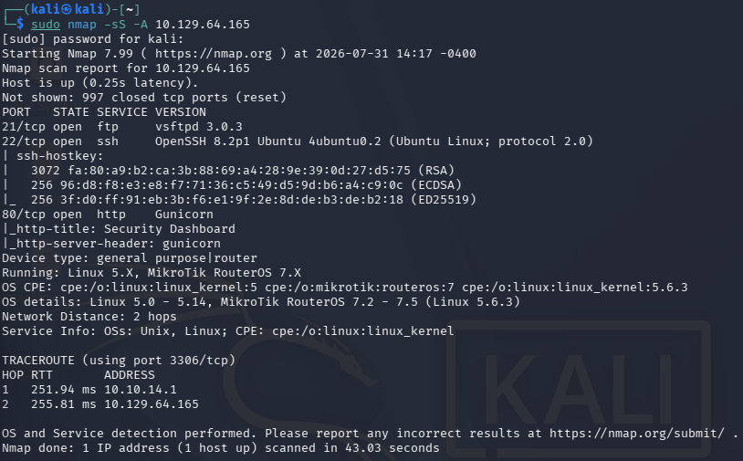
</p>

Three TCP ports came back open: `21` (vsftpd 3.0.3), `22` (OpenSSH 8.2p1), and `80` (Gunicorn / "Security Dashboard").

---

## Task 2
**After running a "Security Snapshot", the browser is redirected to a path of the format `/[something]/[id]`, where `[id]` represents the id number of the scan. What is the `[something]`?**

I've noticed that port 80 is open, so I tried accessing it and what do u know the website is running.

<p align="center">
   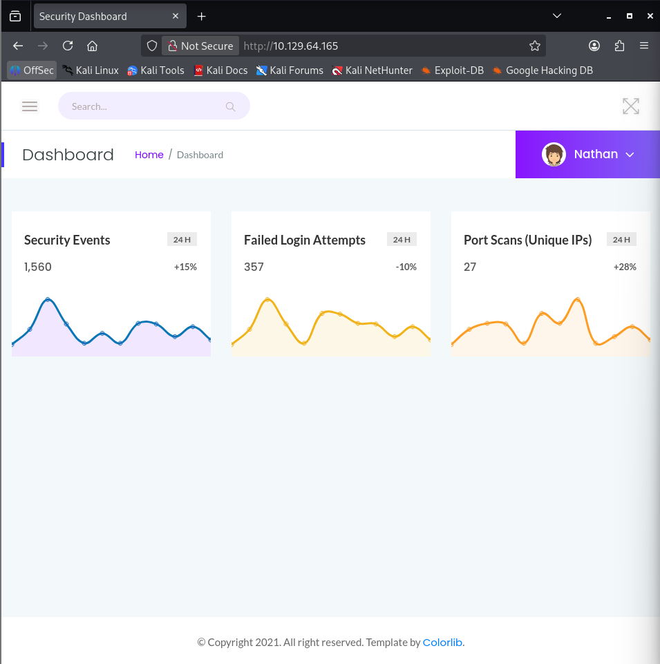
</p>

I've checked around and there's a tab that opens Security Snapshot.

<p align="center">
   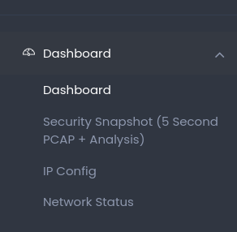
</p>

After clicking the tab, it redirected me to this `http://10.129.64.165/data/1` url. That SOMETHING is `data`.

---

## Task 3
**Are you able to get to other users' scans?**

Based on task 2, I figured that I need to FUZZ for anything other than `/1` (which was my security snapshot). So I used ffuf with this syntax.

```
ffuf -u http://10.129.64.165/data/FUZZ -w /usr/share/wordlists/dirbuster/directory-list-2.3-medium.txt -fc 302
```

<p align="center">
   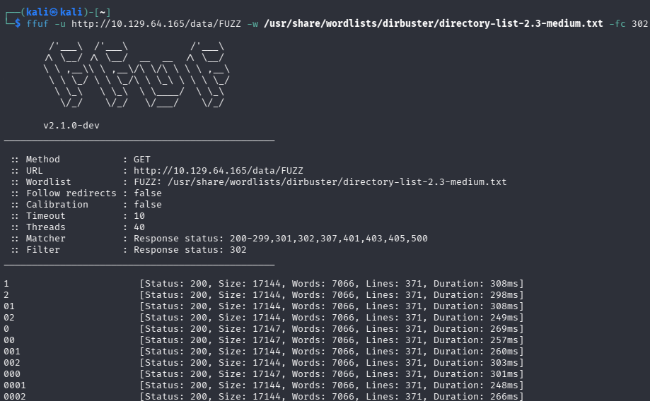
</p>

And voila, there are multiple user scans `/data/` accepts any numeric ID without checking who it belongs to, so this is a straightforward IDOR: yes, I can reach other users' scans just by walking the ID.

---

## Task 4
**What is the ID of the PCAP file that contains sensitive data?**

After checking every possible pcap file, I've found out that `0.pcap` contains sensitive login info.

<p align="center">
   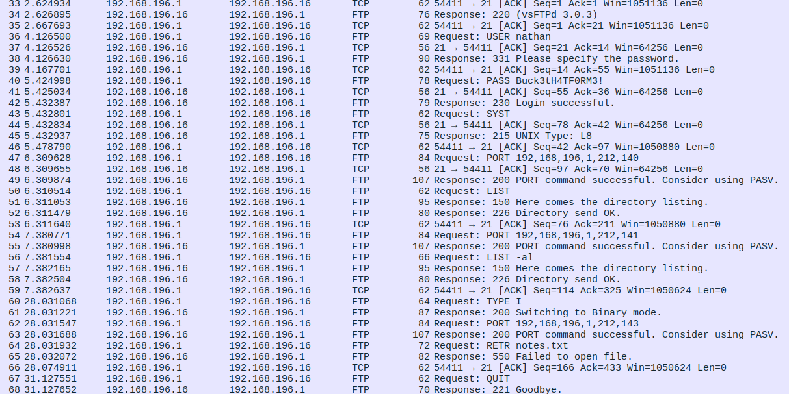
</p>

I've settled that `0` was the ID needed for the answer.

---

## Task 5
**Which application layer protocol in the pcap file can the sensitive data be found in?**

Based on the `0.pcap` file, `ftp` is the protocol where the sensitive info resides, filtering the capture on `ftp` in Wireshark shows a full plaintext login: `USER nathan` followed by `PASS <cleartext password>`, since FTP doesn't encrypt credentials in transit.

<p align="center">
   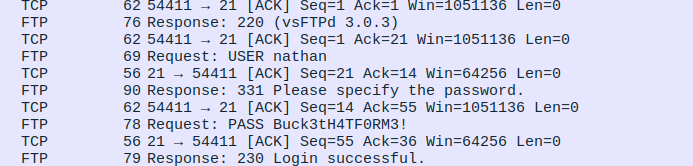
</p>

---

## Task 6
**We've managed to collect nathan's FTP password. On what other service does this password work?**

The only other service open would be `ssh`, and it's the only open service that would take username and password like that.

---

## Task 7
**Get the user flag.**

Based on the nmap scan, and the previously mentioned pcap file, we know that `ssh` is open. The login credentials in the pcap file is what we're going to use.

<p align="center">
   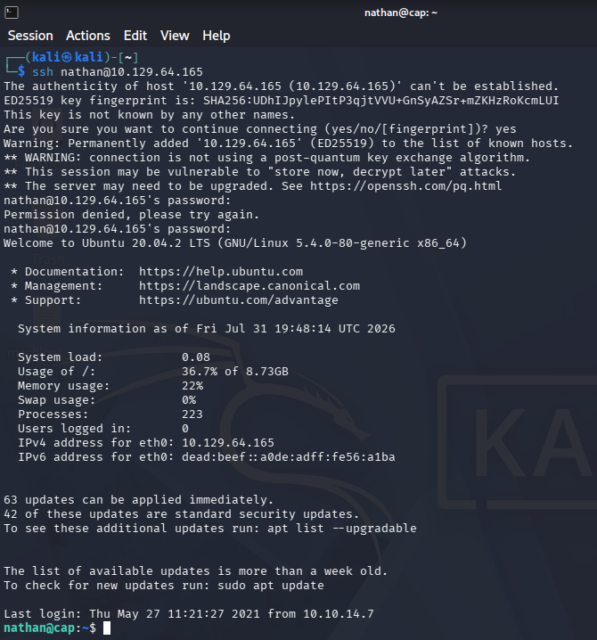
</p>

As you can see, we are now inside Nathan's home directory, while we're at it let's collect the user flag.

<p align="center">
   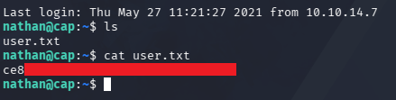
</p>

---

## Task 8
**Now that we're in Nathan's Linux machine, I am going to escalate privileges to get the root flag.**

I've hosted an http server using python so that I can curl it into Nathan's home directory.

<p align="center">
   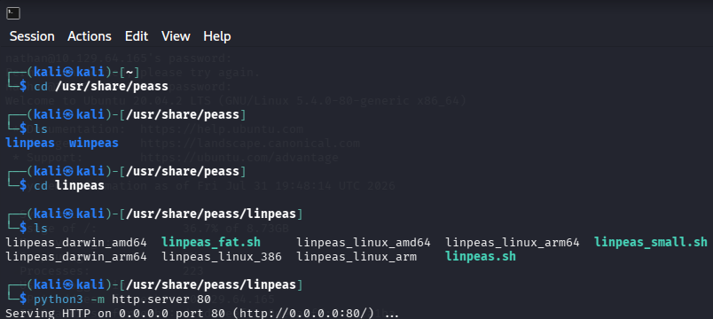
</p>

<p align="center">
   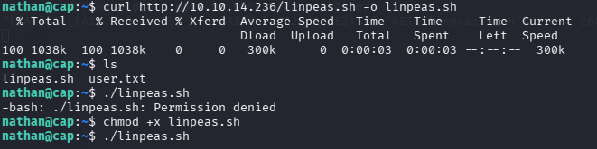
</p>

After running linpeas, I've found something interesting:

<p align="center">
   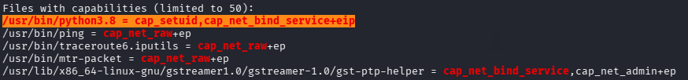
</p>

`/usr/bin/python3.8` has the `cap_setuid+eip` capability set. Normally you'd need to already be root to change your own UID, but a Linux capability lets a specific binary perform that one root-level action without the binary being full SUID root. Since Python can call straight into the `setuid()` syscall, and this capability was attached to the Python interpreter itself, running Python is effectively the same as having root, no exploit needed, just the right one-liner.

This means I can run the python3.8 binary with root privileges, with that I ran a command that would utilize the `cap_setuid` to set my user ID to 0 (which means root) before launching a shell.

<p align="center">
   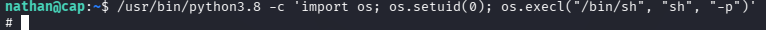
</p>

Voila, now we have a root shell ready to go! With that let's go to the root directory and claim the last flag.

<p align="center">
   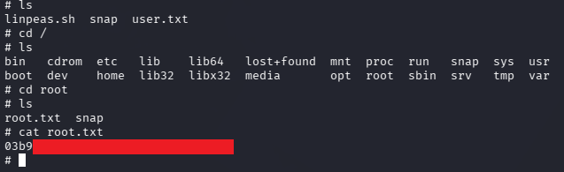
</p>

---

## Summary

| Step | Technique |
| :--- | :--- |
| Recon | `nmap -sS -A` → ftp (21), ssh (22), http (80) |
| Web | IDOR on `/data/[id]` found via ffuf directory fuzzing |
| Loot | Cleartext FTP creds for `nathan` recovered from `0.pcap` in Wireshark |
| Foothold | Password reuse: FTP creds work over SSH |
| Privesc | `cap_setuid+eip` on `/usr/bin/python3.8` → `os.setuid(0)` → root shell |