# FortySeven-1
 
| Investigation Details | |
| :--- | :--- |
| **Category** | *[Threat Intelligence]* |
| **Difficulty** | *[Very Easy]* |
| **Provided Artifacts** | `[N/A]` |
 
---
 
## Scenario Overview
 
> An APT group is using Hajj-themed phishing lures to target and steal WhatsApp data from government and diplomatic officials. Our team has gathered fragmented intelligence from public cybersecurity vendor reports, blog posts, and internal security alerts. Your task is to build a comprehensive profile of the threat actor responsible. You must connect the dots between different reports to answer questions about their identity, tools, and motives.
 
## Sources Used
 
- SecureList: [Mysterious Elephant: a growing threat](https://securelist.com/mysterious-elephant-apt-ttps-and-tools/117596/)
- Knownsec 404 Team: [APT-K-47 (Mysterious Elephant): A New APT Organization in South Asia](https://medium.com/@knownsec404team/apt-k-47-mysterious-elephant-a-new-apt-organization-in-south-asia-5c66f954477)
- Knownsec 404 Team: [Unveiling the Past and Present of APT-K-47 Weapon Asyncshell](https://medium.com/@knownsec404team/unveiling-the-past-and-present-of-apt-k-47-weapon-asyncshell-5a98f75c2d68)
---
 
## Task 1
**What is the primary name of the APT group described in the SecureList report?**
 
The SecureList report is titled "Mysterious Elephant: a growing threat," which is the name Kaspersky assigns to the group throughout the writeup.
 

 
**Answer:** `Mysterious Elephant`
 
---
 
## Task 2
**According to the Knownsec 404 team's analysis (Evidence-3), since which year has this group's attack activity been dated back to?**
 
The Knownsec 404 team's overview states that the group is presumed to have originated in the South Asian region, with attack activity dating back as far as 2022.
 
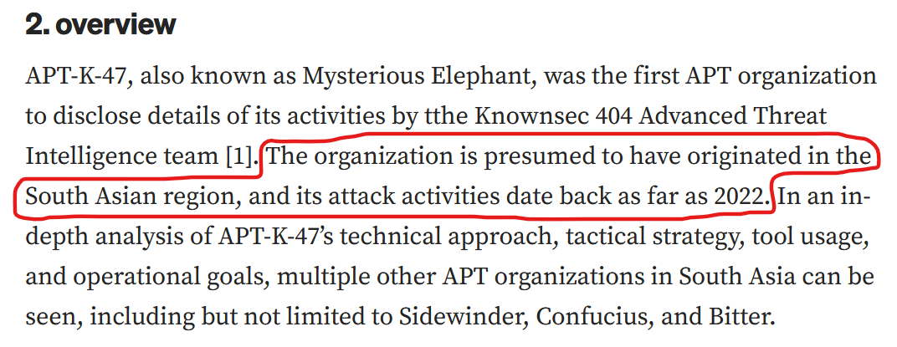
 
**Answer:** `2022`
 
---
 
## Task 3
**The group uses a custom backdoor that communicates via Office Remote Procedure Call (ORPCBackdoor). According to the Knownsec 404 team's analysis (Evidence-2), what is the name of the first malicious exported entry function?**
 
Knownsec 404 identified two malicious exported entries in ORPCBackdoor. The first, and the one asked for here, is `GetFileVersionInfoByHandleEx(void)`, with `DllEntryPoint` listed as the second.
 
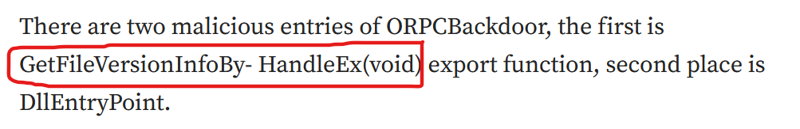
 
**Answer:** `GetFileVersionInfoByHandleEx(void)`
 
---
 
## Task 4
**The previously mentioned backdoor checks for a file before creating persistence. What is the name of the file?**
 
Before creating persistence, ORPCBackdoor checks whether a `ts.dat` file already exists in the same path. If it doesn't, the backdoor proceeds to create persistence (via a scheduled task masquerading as "Microsoft Update") and drops `ts.dat`.
 
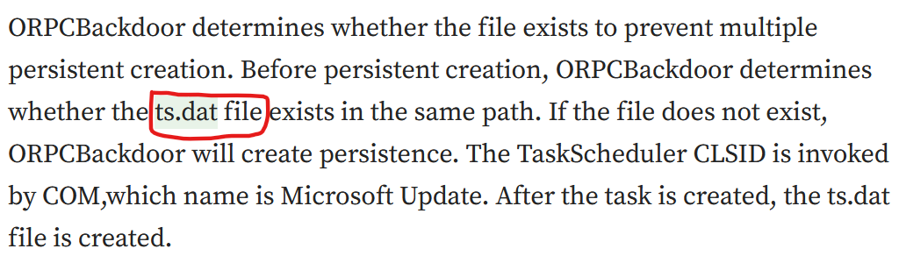
 
**Answer:** `ts.dat`
 
---
 
## Task 5
**The use of the backdoor links the APT to another well-known South Asian APT group. What is the name of this other group?**
 
Knownsec 404 originally attributed ORPCBackdoor to BITTER back in their May 2023 analysis. It was only after Kaspersky's later report on a new group targeting Pakistan that the activity was split out and re-attributed to the newly identified Mysterious Elephant cluster, showing the overlap/link between the two groups.
 
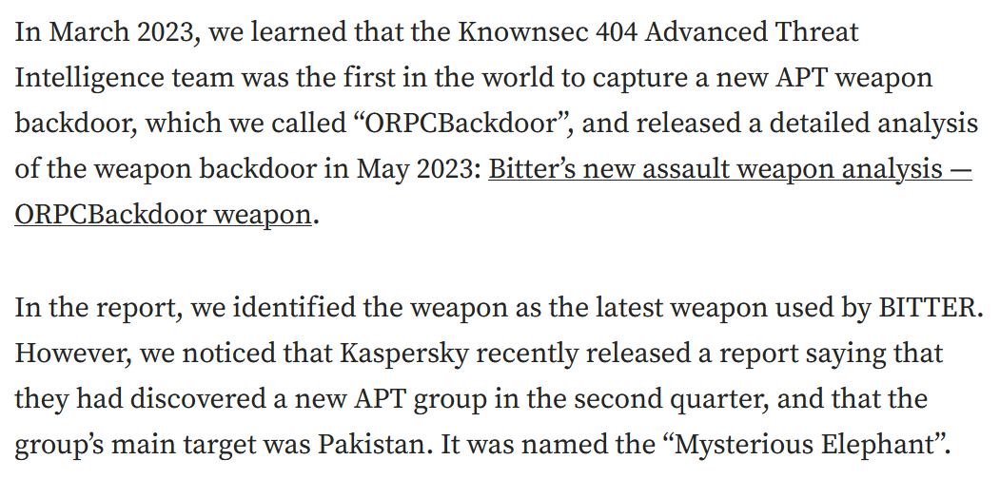
 
**Answer:** `BITTER`
 
---
 
## Task 6
**The APT group we are currently investigating has consistently used and updated another backdoor since 2023, with its C2 communication evolving from TCP to HTTPS. What is the name of this tool?**
 
The group has continually developed a tool called Asyncshell. As its C2 communications moved from TCP to HTTPS, Knownsec 404 tracked the change and began referring to the updated variant as Asyncshell-v2.
 
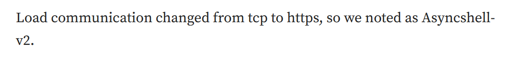
 
**Answer:** `Asyncshell-v2`
 
---
 
## Task 7
**To evade sandbox analysis, the MemLoader HidenDesk tool checks the number of active processes before running. What is the minimum number of processes required for it to proceed?**
 
Per SecureList, MemLoader HidenDesk checks the number of active processes on the machine and terminates itself if fewer than 40 are running, a common anti-sandbox trick since sandboxes typically run far fewer processes than a real user's machine.
 
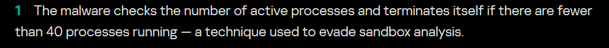
 
**Answer:** `40`
 
---
 
## Task 8
**The MemLoader HidenDesk tool creates a covert environment for its activities by creating and switching to a specific environment. What is the name of this hidden desktop?**
 
The malware creates a hidden desktop named `MalwareTech_Hidden` and switches to it, giving itself a covert environment to operate in away from the visible desktop session. SecureList notes this technique was borrowed from an open-source GitHub project.
 
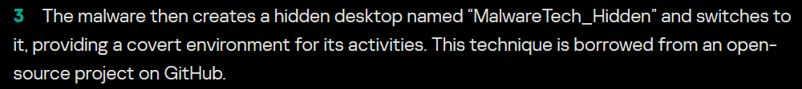
 
**Answer:** `MalwareTech_Hidden`
 
---
 
## Task 9
**The MemLoader HidenDesk tool achieves persistence by placing a shortcut in the autostart folder to ensure it runs after a system reboot. What is the MITRE ATT&CK ID for the 'Registry Run Keys / Startup Folder' technique?**
 
This maps directly to the MITRE ATT&CK sub-technique "Boot or Logon Autostart Execution: Registry Run Keys / Startup Folder."
 
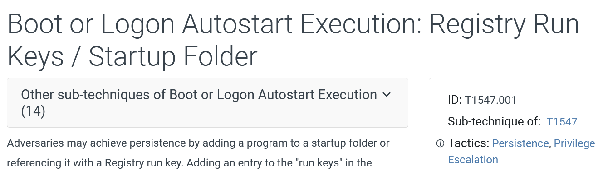
 
**Answer:** `T1547.001`
 
---
 
## Task 10
**The actor uses several custom exfiltration tools targeting WhatsApp. What is the name of the tool that recursively searches specific directories, including the "Desktop" and "Downloads" folders?**
 
SecureList describes the Stom Exfiltrator as a commonly used exfiltration tool that recursively searches specific directories, including "Desktop" and "Downloads," as well as every drive except C:, collecting files by predefined extension. Its latest variant specifically targets files shared through WhatsApp.
 
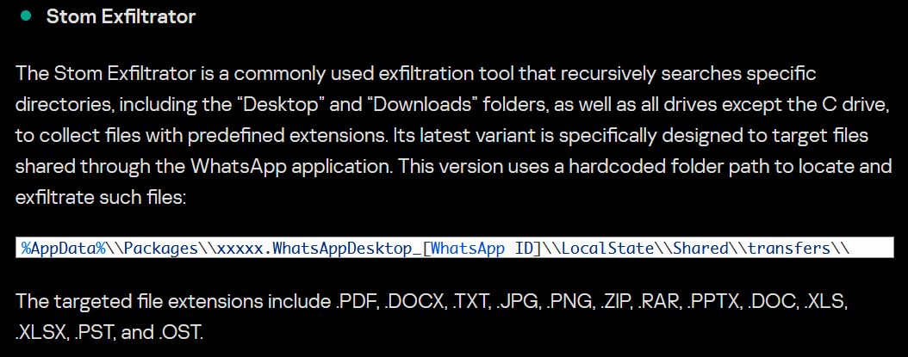
 
**Answer:** `Stom Exfiltrator`
 
---
 
## Task 11
**Kaspersky's analysis highlights the actor's heavy use of scripts for execution and deploying payloads. What is the MITRE ATT&CK ID for the 'PowerShell' technique?**
 
This maps to the MITRE ATT&CK sub-technique "Command and Scripting Interpreter: PowerShell."
 
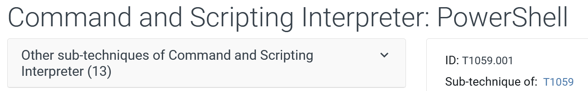
 
**Answer:** `T1059.001`
 
---
 
## Task 12
**In their early attack chains, Mysterious Elephant used a downloader that was previously associated with the Origami Elephant group. What was the name of this downloader?**
 
Knownsec 404 notes that in early attack chains, the actor made use of remote template injection and exploitation of CVE-2017-11882, followed by a downloader called "Vtyrei," which was previously connected to Origami Elephant before being abandoned by that group and picked up here.
 
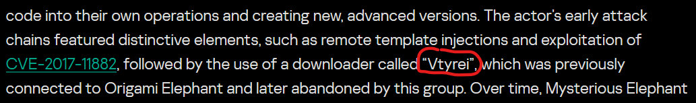
 
**Answer:** `Vtyrei`
 
---
 
## Task 13
**In a January 2024 campaign delivering an Asyncshell payload, which CVE was exploited in the malicious archive file? Be careful to use a hyphen - and not an emdash — in the flag.**
 
Knownsec 404 states they first discovered Asyncshell in January 2024, when they found a malicious sample exploiting the CVE-2023-38831 vulnerability (a WinRAR flaw abused via a crafted archive).
 
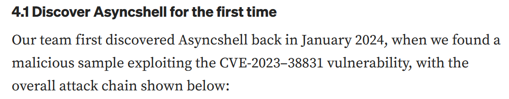
 
**Answer:** `CVE-2023-38831`
 
---
 
## Task 14
**What is the MD5 hash of the ChromeStealer Exfiltrator sample named WhatsAppOB.exe?**
 
SecureList lists the MD5 hash for the ChromeStealer Exfiltrator sample `WhatsAppOB.exe` directly in its indicators table.
 

 
**Answer:** `9e50adb6107067ff0bab73307f5499b6`
 
---
 
## Task 15
**The intelligence describes multiple custom tools designed to upload stolen data to the actor's servers. According to the MITRE ATT&CK framework, what is the ID for the 'Exfiltration Over C2 Channel' technique?**
 
This maps to the MITRE ATT&CK technique "Exfiltration Over C2 Channel," where stolen data is exfiltrated over the existing C2 channel, encoded into the normal C2 protocol.
 
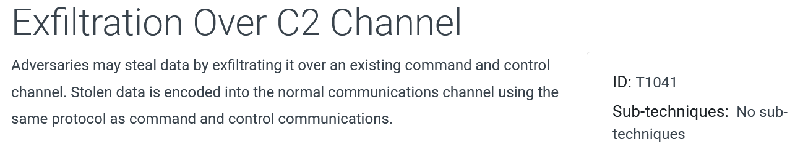
 
**Answer:** `T1041`
 
---
 
## Summary
 
| Area | Finding |
| :--- | :--- |
| Actor identity | Mysterious Elephant / APT-K-47, South Asia, active since at least 2022 |
| Overlap | Linked to BITTER via shared use of ORPCBackdoor |
| Core tooling | ORPCBackdoor, Asyncshell-v2 (TCP → HTTPS evolution), MemLoader HidenDesk, Vtyrei downloader (ex-Origami Elephant) |
| WhatsApp-focused exfil | Stom Exfiltrator, ChromeStealer Exfiltrator |
| Notable exploited CVEs | CVE-2017-11882, CVE-2023-38831 |
| MITRE ATT&CK mapping | T1547.001 (Registry Run Keys / Startup Folder), T1059.001 (PowerShell), T1041 (Exfiltration Over C2 Channel) |