# Fruitzy

| Investigation Details | |
| :--- | :--- |
| **Category** | *DFIR* |
| **Difficulty** | *Easy* |

---

## Scenario Overview

> CyberJunkie started out as a junior QA Analyst at his friend's startup. He called the CEO of the startup because he believed he had mistakenly downloaded something malicious. The CEO sought help from you, his friend in the cybersecurity field. You sent him a guide on collecting evidence from the machine using KAPE. Now you have been given the forensic image so you can analyze and help your friends, as they cannot afford to hire an MSSP.

---

## Task 1
**What is the Subject/topic of the Phishing email?**

One of the provided artifacts is an eml file named 'Special Party Invitation from JANET CARNAHAN.eml'

I put the eml file name in the answer box and it was accepted.

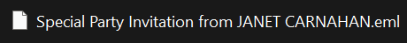

**Answer:** `Special Party Invitation from JANET CARNAHAN`

---

## Task 2
**What is the malicious URI that the malicious link redirected to?**

Since I can't get the actual URI in the email artifact, I checked the user's web history. Luckily, the evidence still had their Microsoft Edge history. Sure enough I saw the email link 'https://pomi.digital/premium' and it redirected to the download page which serves as the answer as well.

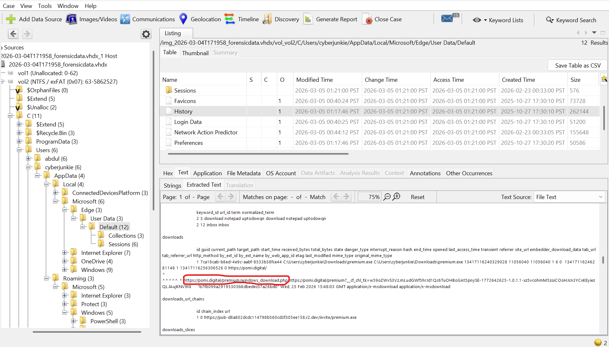

**Answer:** `https://pomi.digital/premium/windows_download.php`

---

## Task 3
**What is the name of the downloaded file?**

At the same time, I found the payload URL, which shows where the downloaded file was retrieved from, as shown in the picture below.

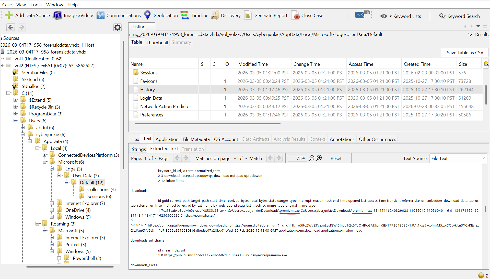

**Answer:** `premium.exe`

---

## Task 4
**When was the downloaded file executed by the victim according to Amcache?**

AmCache doesn't record execution directly, but the InventoryApplicationFile key's LastWriteTimestamp is a reliable proxy for first execution. For premium.exe, this was recorded at the time shown below.

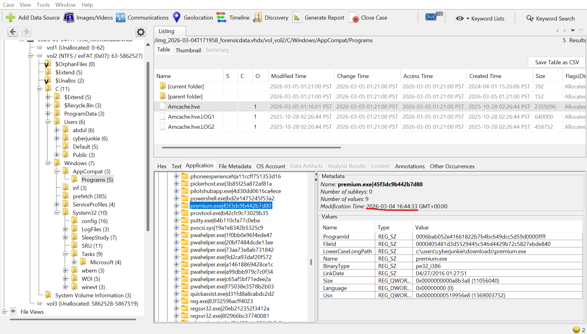

**Answer:** `2026-03-04 16:44:33`

---

## Task 5
**What is the SHA256 hash of the malicious executable downloaded from the phishing Website?**

I noticed that the FileID value in Amcache looks like a hash construct, it looks like a SHA1 digest.

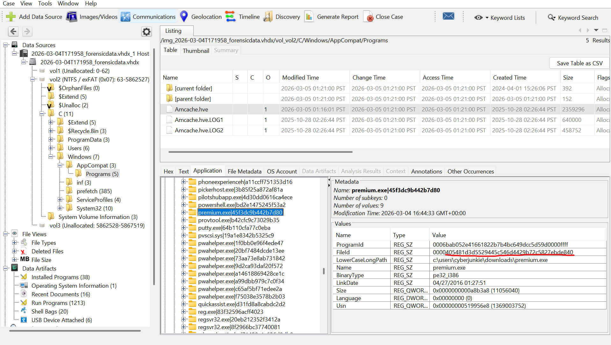

So after inputting said hash in VirusTotal, I hit the jackpot, it was the same file recorded.

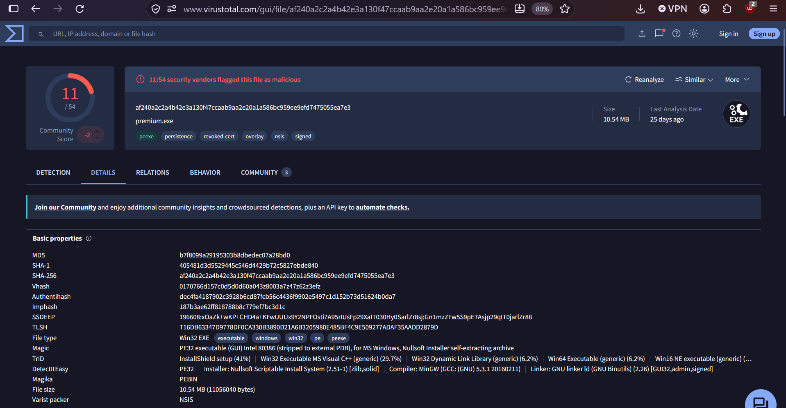

**Answer:** `af240a2c2a4b42e3a130f47ccaab9aa2e20a1a586bc959ee9efd7475055ea7e3`

---

## Task 6
**The user executed the file, but no invitation appeared or was found. They then used Microsoft Defender to scan the file. When was this scan initiated?**

Good thing we had the EVTX file for Windows Defender, these kinds of labs don't usually include it. After filtering through the logs, I found the Defender event that scanned the malicious file premium.exe.

Side note, the lab artifact's timezone is PST, so I had to double check and calculate to UTC so we stay consistent.

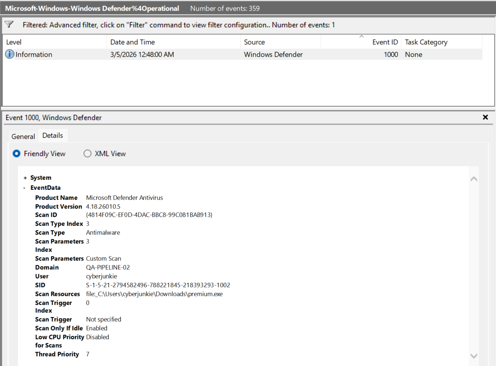

**Answer:** `2026-03-04 16:48:00`

---

## Task 7
**The malware installed a Remote Monitoring and Management (RMM) tool as a backdoor for potential remote access. What was the service name?**

This is essentially a persistence check. These types of malware install services to survive reboot.

I checked the SYSTEM registry hive for suspicious services, searching in Autopsy and double-checking with an online parser, and found it.

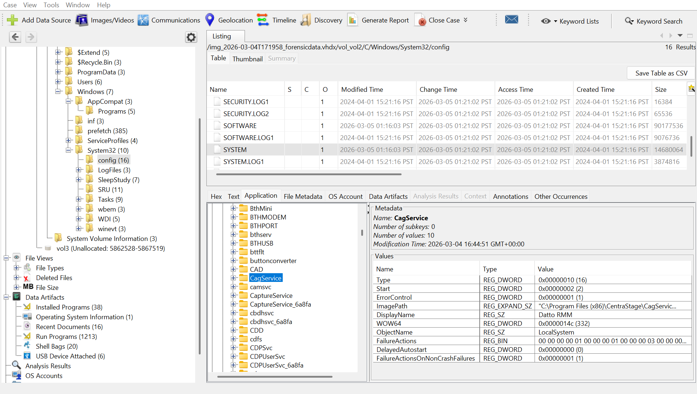

Its Start value is 0x00000002 (2), so it runs automatically on reboot. It's also its own process (0x00000010 / 16) and runs as LocalSystem, giving it the highest privilege. The most suspicious part is its modification time (16:44:51), just 18 seconds after AmCache recorded premium.exe's execution at 16:44:33.

Looking up CagService, it turned out to be a known process for Datto RMM, a legitimate RMM tool, not malware on its own. This is a common technique where threat actors abuse a trusted, signed tool for persistence, since it evades antivirus detection more easily than custom malware would.

**Answer:** `CentraStage`

---

## Task 8
**The malicious backdoor installation time stomped the RMM executables. What was the modified timestamp set to these executables?**

After parsing the $MFT. I've located CagService.exe. The SI (Standard Information) shows the timestomped dates while the FN (File Name) shows the real time (16:44:34) which is the time when premium.exe was executed.

**Answer:** `2026-02-09 07:56:40`

---

## Task 9
**What is the name of the company whose product is the RMM tool?**

Going back to Task 7, I looked up CagService.exe and found it belongs to RMM software made by the IT company shown in the picture below.

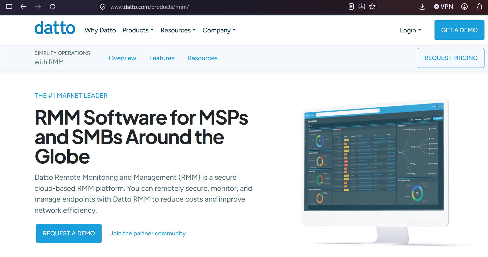

**Answer:** `Datto`

---

## Task 10
**Pivoting back to the malicious link, when was the domain registered?**

I put the domain name of the malicious link in several websites like Whois and all dns lookups. But VirusTotal gave me the answer.

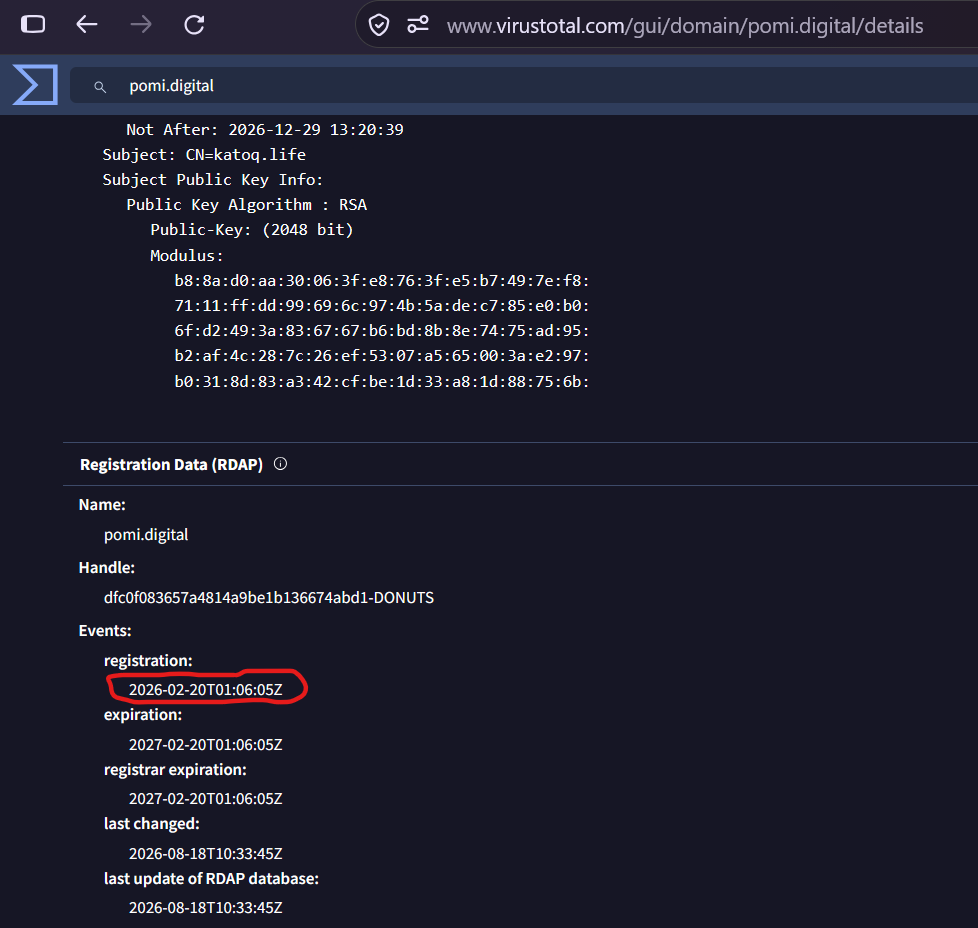

**Answer:** `2026-02-20 01:06:05`

---

## Task 11
**Utilizing threat intelligence sources, what is another name for the executable that was initially downloaded?**

I utilized VirusTotal again and by clicking the details tab, I saw its aliases.

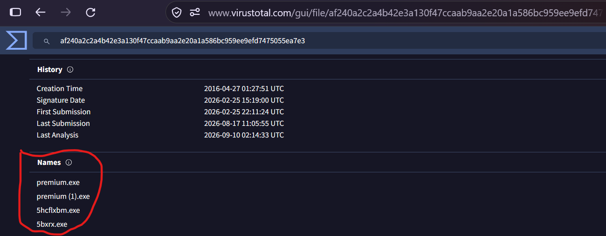

**Answer:** `5bxrx.exe`

---
 
## Summary
 
| Area | Finding |
| :--- | :--- |
| Actor identity | Mysterious Elephant / APT-K-47, South Asia, active since at least 2022 |
| Overlap | Linked to BITTER via shared use of ORPCBackdoor |
| Core tooling | ORPCBackdoor, Asyncshell-v2 (TCP → HTTPS evolution), MemLoader HidenDesk, Vtyrei downloader (ex-Origami Elephant) |
| WhatsApp-focused exfil | Stom Exfiltrator, ChromeStealer Exfiltrator |
| Notable exploited CVEs | CVE-2017-11882, CVE-2023-38831 |
| MITRE ATT&CK mapping | T1547.001 (Registry Run Keys / Startup Folder), T1059.001 (PowerShell), T1041 (Exfiltration Over C2 Channel) |